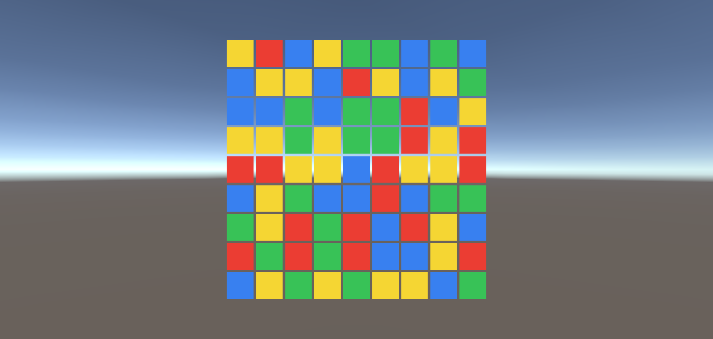

# 3Match Prototype

Unity로 만든 3매치 퍼즐 프로토타입입니다. 씬에 별도 배치 없이 플레이를 시작하면 런타임에 보드와 HUD가 자동 생성됩니다.

## Screenshots

https://github.com/user-attachments/assets/d52514c6-18d2-4f84-bb46-97accdfd9345

### Gameplay

## Game Overview

- 보드 크기: `9 x 9`
- 기본 타일 색상: 파랑, 빨강, 초록, 노랑
- 인접한 두 타일을 스왑해서 3개 이상 같은 색을 맞추면 제거됩니다.
- 제거 후에는 낙하와 리필이 일어나며, 연쇄 매치가 이어질 수 있습니다.
- 점수, 콤보 배수, 이펙트 라벨이 화면 상단 HUD에 표시됩니다.

## Controls

1. 마우스로 타일을 클릭한 뒤 인접한 타일 방향으로 드래그합니다.
2. 특수 타일은 클릭만으로도 즉시 발동할 수 있습니다.
3. 스왑 결과가 유효하지 않으면 원래 위치로 되돌아갑니다.

## Special Tiles

### RowClear
- 생성: 4개 매치
- 생성 방향 규칙:
  - 위/아래 스왑으로 4매치를 만들면 `ColumnClear`
  - 좌/우 스왑으로 4매치를 만들면 `RowClear`
- 효과: 해당 행 전체 제거

### ColumnClear
- 생성: 4개 매치

- 효과: 해당 열 전체 제거

### ColorClear
- 생성: 5개 이상 매치
- 효과: 선택된 색상의 일반 타일 전체 제거

### Bomb
- 생성: 가로 3개와 세로 3개가 교차하는 형태의 매치
- 효과: 중심 기준 `3 x 3` 범위 제거

## Special Combos

- `ColorClear + RowClear / ColumnClear / Bomb`
  - 랜덤 색상 1종을 선택한 뒤, 그 색 타일들 각각에 상대 특수 아이템 효과를 적용합니다.
  - 적용 대상 위치는 삭제 전에 약 2초 동안 아이콘 프리뷰로 표시됩니다.
- `RowClear + ColumnClear`
  - 교차 지점 기준 십자 제거
- `RowClear + RowClear`, `ColumnClear + ColumnClear`
  - 중심 기준 십자 제거
- `Bomb + Bomb`
  - 각 폭탄 위치 기준 `3 x 3` 범위 제거
- `Bomb + RowClear`
  - 중심 기준 가로 3줄 제거
- `Bomb + ColumnClear`
  - 중심 기준 세로 3줄 제거
- `ColorClear + ColorClear`
  - 보드 전체 제거

## Project Structure

- `Assets/Scripts/Match3/Match3Bootstrap.cs`
- `Assets/Scripts/Match3/Match3Game.cs`
- `Assets/Scripts/Match3/TileView.cs`
- `Assets/Scripts/Match3/TileData.cs`
- `Assets/Scripts/Match3/TileColor.cs`
- `Assets/Scripts/Match3/SpecialTileType.cs`
- `Assets/Scripts/Match3/MatchPattern.cs`
- `Assets/Scripts/Match3/ActivationResult.cs`
- `Assets/Scripts/Match3/ComboPopup.cs`

## Run

1. Unity에서 프로젝트를 엽니다.
2. 아무 씬에서든 `Play`를 누릅니다.
3. `Match3Bootstrap`이 `3MatchGame` 오브젝트와 카메라 구성을 자동으로 준비합니다.

